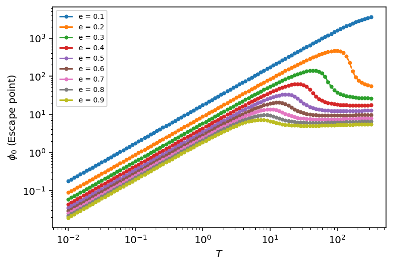

# NumPy/SciPy/SymPy/Matplotlib example

This code takes some specific potential found in Quantum Field Theory given as

$$V = \frac{\lambda}{4} \varphi^3 + \frac{3 M^4}{64 \pi^2} \left[ \ln \left(\frac{M^2}{\mu^2}\right) - \frac{5}{6} \right] + \frac{2T^4}{2 \pi^2} \left( - \frac{4\pi}{45} + \frac{2\pi}{12} \frac{M^2}{T^2} - \frac{\pi}{6} \left(\frac{M}{T}\right)^3 - \frac{1}{32 M^4} \frac{1}{T^4} \right) \log \left( \frac{M^2}{a_b T^4} \right) + $$
$$+ \frac{3T}{2\pi} \left( m_V^3 - (m_V^2 + \Pi_V)^{3/2} \right) $$

and it calculates bounce equation for this potential for given temperatures ($T$) and parameters $e$. Than it takes escape point it calculated for every such paor of parameters and it makes plot of it.

